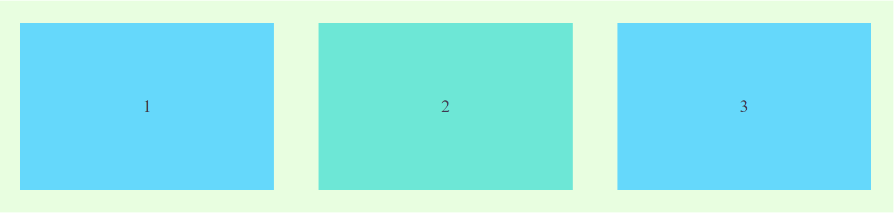
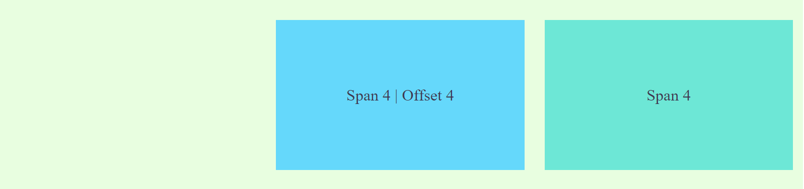

#  falconjs-component-flexgrid

12 Column Flex Grid Component for [FalconJS](https://github.com/falcon-js/falcon)  

## Getting Started
inside your FalconJS App directory

- Install the package ```npm install --save  falconjs-component-flexgrid```  or ```yard add falcon-js-component-flexgrid```

- Import inside your App ``` import {Row, Col} from 'falconjs-component-flexgrid'```

### Usage

#### Baseline
In Rows use the gutter property for spacing.
In Columns use the span property to define the span of the column on the 12 grid

```
    <Row gutter={40} >
          <Col span={4}><div>1</div></Col>
          <Col span={4}><div>2</div></Col>
          <Col span={4}><div>3</div></Col>
    </Row>
```



#### Offset

Offset the position of the column to the right.

```
   <Row gutter={20}>
          <Col span={4} offset={4}> <div>Span 4 | Offset 4</div></Col>
          <Col span={4}><div>Span 4</div></Col>
   </Row>
```



 #### Order
 Sort the columns within ```<Row>```

```
    <Row gutter={20}>
        <Col span={4} order={3}><div>C</div></Col>
        <Col span={4} order={2}><div>B</div></Col>
        <Col span={4} order={1}><div>A</div></Col>
    </Row>
```


#### Align and Distribute
```justify``` to distribute the columns inside the row 
    options:  ```start```, ```center```, ```end```, ```space-between```, and ```space-around```
    code snippet ```<Row justify="center">```
    

``` vertical``` to vertical align the columnds inside the row 
options: ```top```, ```middle```, ```bottom```
code snippet ```<Row vertical="top">```


Flexbox parameters can be passed to Row to align and distribute the columns inside it.

##### Vertical alignment

```
        <Row gutter={20} justify="center" vertical="bottom">
          <Col span={4} > <div class="tall">Tall</div></Col>
          <Col span={4} > <div class="medium">Medium</div> </Col>
          <Col span={4} > <div class="short">Short</div></Col>
        </Row>
```


```
        <Row gutter={20} justify="center" vertical="middle">
          <Col span={4} > <div class="tall">Tall</div></Col>
          <Col span={4} > <div class="medium">Medium</div> </Col>
          <Col span={4} > <div class="short">Short</div></Col>
        </Row> 
```


```
        <Row gutter={20} justify="center" vertical="top">
          <Col span={4} > <div class="tall">Tall</div></Col>
          <Col span={4} > <div class="medium">Medium</div> </Col>
          <Col span={4} > <div class="short">Short</div></Col>
        </Row>   
```


##### Distribute (Justify)

```
        <Row gutter={20} justify="start">
          <Col span={3} > <div class="tall">Tall</div></Col>
          <Col span={3} > <div class="medium">Medium</div> </Col>
          <Col span={3} > <div class="short">Short</div></Col>
        </Row>
```


```
        <Row gutter={20} justify="center">
          <Col span={3} > <div class="tall">Tall</div></Col>
          <Col span={3} > <div class="medium">Medium</div> </Col>
          <Col span={3} > <div class="short">Short</div></Col>
        </Row>
```


```
        <Row gutter={20} justify="end">
          <Col span={3} > <div class="tall">Tall</div></Col>
          <Col span={3} > <div class="medium">Medium</div> </Col>
          <Col span={3} > <div class="short">Short</div></Col>
        </Row>
```


```
        <Row gutter={20} justify="space-between">
          <Col span={3} > <div class="tall">Tall</div></Col>
          <Col span={3} > <div class="medium">Medium</div> </Col>
          <Col span={3} > <div class="short">Short</div></Col>
        </Row>
```


```
        <Row gutter={20} justify="space-around">
          <Col span={3} > <div class="tall">Tall</div></Col>
          <Col span={3} > <div class="medium">Medium</div> </Col>
          <Col span={3} > <div class="short">Short</div></Col>
        </Row>
```


#### Responsive
dimension ```xs```, ```sm```, ```md```, ```lg```, ```xl```

```
        <Row gutter={20} justify="center" vertical="top">
          <Col xs={12} sm={12}  md={4} lg={6} xl={6}><div> xs-12 sm-12 md-4 lg-6 xl-6</div></Col>
          <Col xs={12} sm={12} md ={8} lg={6} xl={6}><div> sm-12 sm-12 md-8 lg-6 xl-6</div></Col>
        </Row>
```


*note: span and offset can be defined as a property of the query like so ```md={{ span:4, offset: 4}} ```

##Component Properties

### Row
```<Row>```

|Property|Description|Type|Default|Options|
|---|---|---|---|---|
|vertical|Vertical alignment of the Columns inside the Row|String|```start```| ```start```, ```middle```, ```botoom```|
|gutter|Spacing between columns | Number| 0 | 0 to ...|
|justify|Horizontal distributionon the columns |  String | ```start```| ```start```,```end```,```center```, ```space-around```, ```space-between```|


### Col
```<Col>```


|Property|Description|Type|Default|Note|
|---|---|---|---|---|
|span| Number of Cells to be occupied by the Columns| Number| none | setting setting the value to 0 would yield ```display:none``` to the Column|
|offset| cell offset from the left of the Column| Number | 0||
|order| column number in row| Number | node| This will result to sorting of the Columns inside a particular row|
|xs| <768px and also default setting, could be a span value or a object contain above props | Number or Object | | media query
|sm| ≥768px, could be a span value or a object contain above props | Number or Object | | media query|
|md| ≥992px, could be a span value or a object contain above props | Number or Object | | media query|
|lg| ≥1200px, could be a span value or a object contain above props | Number or Object | | media query|
|xl| ≥1600px, could be a span value or a object contain above props | Number or Object | | media query|

### Contributions and request are welcome!
Please Fork and submit PR

### Testing
Prerequesite on testing install ```parcel``` to install ```npm i -g parcel-bundler```
- Clone this repo ```git clone https://github.com/jmdisuanco/falconjs-component-flexgid```
- ```cd falcon-js-component-flexgrid```
- ```npm start ```
- the demo will be served on  ```http://localhost:8000```

### Base on
This is based on FalconJS flex grid component is based on Abraztsov's [ReactSimpleFlexGrid](https://github.com/abraztsov/ReactSimpleFlexGrid)

